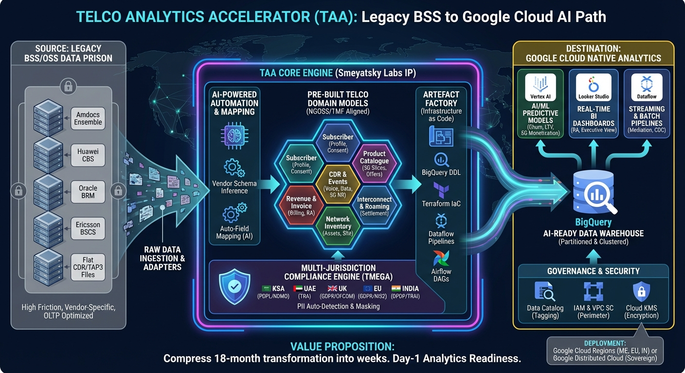

# TAA - Telco Analytics Accelerator

Production-ready code generation tool that transforms telco BSS/OSS configurations into BigQuery DDL, Terraform infrastructure, Dataflow pipelines, Airflow DAGs, and compliance reports. Supports multi-cloud deployment (GCP, AWS, Azure) with jurisdiction-aware data governance for 10 regulatory frameworks.

## Architecture



## Quick Start

### Installation

```bash
# Clone the repository
git clone <repo-url> && cd taa

# Install in development mode
pip install -e ".[dev]"

# Verify installation
taa --version
```

### Basic Usage

```bash
# List available domains
taa domain list

# Generate a full artefact pack for subscriber and CDR domains (Saudi jurisdiction)
taa generate pack -d subscriber,cdr_event -j SA -o ./output

# Estimate cloud costs
taa estimate -d subscriber,cdr_event -s 5000000 --cloud gcp
```

## CLI Commands

### Domain Management

| Command | Description | Example |
|---------|-------------|---------|
| `taa domain list` | List all 7 telco domains | `taa domain list` |
| `taa domain show <name>` | Show tables in a domain | `taa domain show subscriber` |

### Vendor Mappings

| Command | Description | Example |
|---------|-------------|---------|
| `taa vendor list` | List supported BSS vendors | `taa vendor list` |
| `taa vendor map <vendor> <domain>` | Show vendor-to-canonical mapping coverage | `taa vendor map amdocs subscriber` |

### Jurisdictions

| Command | Description | Example |
|---------|-------------|---------|
| `taa jurisdiction list` | List all 10 supported jurisdictions | `taa jurisdiction list` |

### Code Generation

| Command | Description | Example |
|---------|-------------|---------|
| `taa generate ddl` | Generate BigQuery DDL | `taa generate ddl -d subscriber -j SA -o ./output` |
| `taa generate terraform` | Generate Terraform config | `taa generate terraform -d subscriber,cdr_event -j AE -o ./output` |
| `taa generate pipeline` | Generate Dataflow pipeline code | `taa generate pipeline -d cdr_event -v amdocs -o ./output` |
| `taa generate dag` | Generate Airflow DAG | `taa generate dag -d subscriber -o ./output` |
| `taa generate compliance` | Generate compliance reports | `taa generate compliance -d subscriber -j SA -o ./output` |
| `taa generate analytics` | Generate analytics SQL (BQML / Vertex AI) | `taa generate analytics -t churn_prediction -o ./output` |
| `taa generate aws` | Generate AWS artefacts (Redshift DDL + CloudFormation) | `taa generate aws -d subscriber -j SA -o ./output` |
| `taa generate azure` | Generate Azure artefacts (Synapse DDL + Bicep) | `taa generate azure -d subscriber -j SA -o ./output` |
| `taa generate mock-data` | Generate synthetic BSS test data | `taa generate mock-data -d subscriber -r 100 --seed 42 -o ./output` |
| `taa generate notebook` | Generate Vertex AI / Jupyter notebooks | `taa generate notebook -t churn_prediction -o ./output` |
| `taa generate dashboard` | Generate Looker Studio dashboard configs | `taa generate dashboard -t revenue_assurance -o ./output` |
| `taa generate pack` | Generate full artefact pack | `taa generate pack -d subscriber,cdr_event -j SA -v amdocs -o ./output` |

### Schema Import

| Command | Description | Example |
|---------|-------------|---------|
| `taa schema import <file>` | Import DDL/CSV, auto-detect vendor, suggest mappings | `taa schema import schema.ddl -f ddl -o report.md` |
| `taa schema connect` | Connect to a live BSS database and introspect | `taa schema connect --host db.local --port 1521 --database BSSDB --username admin --db-type oracle` |
| `taa schema ai-map <file>` | AI-powered schema mapping (Claude / Gemini) | `taa schema ai-map schema.ddl -p anthropic -o mapping.md` |

### Cost Estimation

| Command | Description | Example |
|---------|-------------|---------|
| `taa estimate` | Estimate cloud infrastructure costs | `taa estimate -d subscriber,cdr_event -s 1000000 --cloud gcp --region me-central1` |

### MCP Server

| Command | Description | Example |
|---------|-------------|---------|
| `taa mcp serve` | Start the TAA MCP server | `taa mcp serve --host localhost --port 8080` |

## Domain Model

TAA covers 7 telco analytics domains:

| # | Domain | Description |
|---|--------|-------------|
| 1 | `subscriber` | Customer and account management |
| 2 | `product_catalogue` | Products, plans, and offers |
| 3 | `cdr_event` | Call detail records and usage events |
| 4 | `revenue_invoice` | Billing, invoicing, and revenue |
| 5 | `interconnect_roaming` | Interconnect and roaming agreements |
| 6 | `network_inventory` | Network assets and topology |
| 7 | `usage_analytics` | Aggregated usage and behavioral analytics |

Each domain contains a set of canonical tables with typed columns, partitioning strategies, clustering keys, and PII classification.

## Vendor Mappings

4 BSS vendor platforms are supported with field-level mappings to the canonical model:

| Vendor | Platform |
|--------|----------|
| Amdocs | CRM / Billing |
| Huawei CBS | Convergent Billing System |
| Oracle BRM | Billing and Revenue Management |
| Ericsson BSCS | Business Support Control System |

Use `taa vendor map <vendor> <domain>` to view mapping coverage and identify unmapped fields.

## Jurisdictions

10 regulatory jurisdictions with data residency enforcement:

| Code | Country | Framework | GCP Region | Data Residency |
|------|---------|-----------|------------|----------------|
| SA | Saudi Arabia | PDPL | me-central1 | Yes |
| AE | UAE | PDPL | me-central1 | Yes |
| KW | Kuwait | CITRA | me-central1 | Yes |
| EG | Egypt | NTRA | me-central2 | Yes |
| GB | United Kingdom | GDPR + PECR | europe-west2 | No |
| EU | European Union | GDPR | europe-west1 | No |
| IN | India | DPDP | asia-south1 | Yes |
| TR | Turkey | KVKK | europe-west1 | Yes |
| IE | Ireland | GDPR + ePrivacy | europe-west1 | No |
| ZA | South Africa | POPIA | africa-south1 | Yes |

## Multi-Cloud Support

TAA generates infrastructure-as-code for three cloud providers:

| Cloud | Compute / Data Warehouse | IaC Format |
|-------|--------------------------|------------|
| GCP | BigQuery, Dataflow, Composer | Terraform (HCL) |
| AWS | Redshift | CloudFormation (YAML) |
| Azure | Synapse Analytics | Bicep |

GCP also supports Google Distributed Cloud (GDC) for on-premise / sovereign edge deployments with BigQuery Omni and BigLake external connections.

## Key Features

### Schema Import
Import existing database schemas from DDL files or CSV exports. TAA auto-detects the BSS vendor and suggests field-level mappings to the canonical model with gap analysis.

### AI-Powered Mapping
Use Claude (Anthropic) or Gemini (Google) to intelligently map vendor schema fields to canonical domains when heuristic matching is insufficient.

### BSS Connector
Connect directly to a live BSS database (Oracle, MySQL, PostgreSQL, MSSQL), introspect the schema, and generate mapping suggestions without exporting files.

### Cost Estimation
Estimate monthly and annual cloud infrastructure costs based on subscriber count, CDR volume, cloud provider, region, and retention period.

### Analytics Templates
Generate BigQuery ML and Vertex AI SQL templates for common telco analytics use cases: churn prediction, revenue leakage, ARPU analysis, network quality, and 5G monetization.

### Vertex AI Notebooks
Generate production-ready Jupyter notebooks (.ipynb) for churn prediction, revenue leakage detection, and subscriber lifetime value models using BigQuery ML.

### Looker Studio Dashboards
Generate dashboard configuration JSON files for 4 pre-built dashboards: Revenue Assurance, Churn Analytics, 5G Monetisation, and Roaming & Interconnect.

### Mock Data Generator
Generate synthetic BSS test data (CSV or JSONL) for any domain, with PII-aware data generation, configurable row counts, and reproducible seeds for demo and testing.

## Development

### Prerequisites

- Python 3.11+
- pip

### Setup

```bash
pip install -e ".[dev]"
```

### Running Tests

```bash
# Run all tests with coverage
pytest tests/ -v --cov=taa --cov-report=term-missing
```

### Project Structure

```
taa/
  domain/           # Entities, value objects, ports, events
  application/      # Use cases, commands, DTOs
  infrastructure/   # Generators, templates, config, schema import
  presentation/     # CLI (Click), MCP server
tests/              # Test suite
```

## License

See LICENSE file for details.
